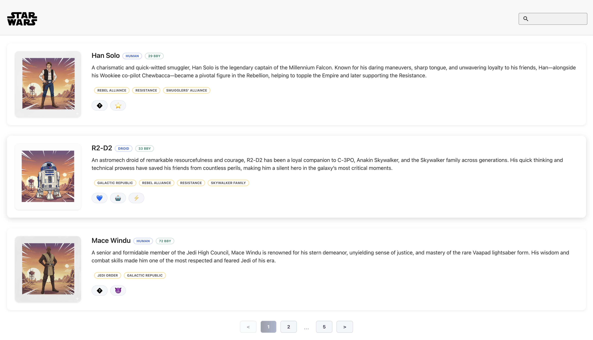

# LumApps Frontend Test

Welcome to the LumApps Frontend Technical Test. In this test, you will create a small frontend application using the technologies that we at LumApps use in our daily routine.

## The task

The task is to create a simple frontend application that retrieves data from a server and renders a list of entities. You will be using a locally provided API to list the different characters, allow the user to search for a character based on their name and to display characters' reactions.

### Mockup

Below you will find a low-fidelity mockup of the application which should give you the idea of how the application should work. This does not mean that your solution needs to be exactly identical to the design. We do not want you to be pixel-perfect; however, a general coherence in terms of style, spacing and sizes will be evaluated.

Each result displays:
- Character's image
- Character's name
- Character's description
- Character's species, birth year, affiliations.

The Pagination component should be present at the bottom of the page.

### Acceptance criteria

For this test to be completed, your application should fulfill the following criteria:
- As a user, I can search for a character by typing on the Search field. As a result, a list of 4 matching characters is displayed. An API is provided to retrieve the characters.
- As a user, I can browse through the results using a pagination component visible at the bottom of the page.
- As a user, I can see the reactions that each of these characters has. A second API is provided to retrieve the reactions.

These criteria are what we require to consider this test as complete. Any additional functionalities should come as secondary. If the search, reactions or the pagination features do not work or are not developed, the test will be considered as incomplete, and it will affect the final review.

## What will be evaluated?

The objective of this test is to evaluate different topics of frontend development. Specifically:
- The level of expertise that you have with the web stack, which includes HTML, CSS, TypeScript and how you use these languages to solve a problem.
- The level of expertise when it comes to TypeScript and Vue.js in general. 
- The attention that you have for the general quality of the application. Specifically, in terms of:
    - Accessibility
    - Performance
    - Usability and visual coherence
    - Maintainability
    - Edge case management

## Stack

In this exercise, we encourage you to use the technologies that we use in our daily basis:
*   HTML
*   TypeScript
*   Vue.js
*   SCSS
*   Webpack
*   Yarn

If you want to use other technologies, patterns or add features to enhance your application (such as Vuex, Jest, RTL, responsive design), you are free to do so.

As for using a component library, you have multiple choices:
- If you already know and use a specific Vue.js component library, you can use it and save some time on the development process.
- If you do not know any library, use the one already installed: [https://next.vuetifyjs.com/en/](https://next.vuetifyjs.com/en/)

### Ground rules

* We strongly suggest that you use the technologies suggested under the Stack section.
* If you want to use your own boilerplate, you are free to override the whole repository, but you should note that this could take more time than just using the provided one.

## Setup

You should download the code and create your own repository.

In the project directory, you need to run: `yarn`
This will setup the necessary dependencies to execute this project.

You will need to use Node.js version 20 in order to run this project. Not doing so will result in an error. We suggest using a node version manager [nvm](https://github.com/nvm-sh/nvm) for the purpose.

To start development, execute `yarn start`, which will run the app in development mode.

## Project delivery

This project should be accessible on GitHub as either a private or public repository. Your recruiter will provide further details when it comes to who to give access to the repository.
